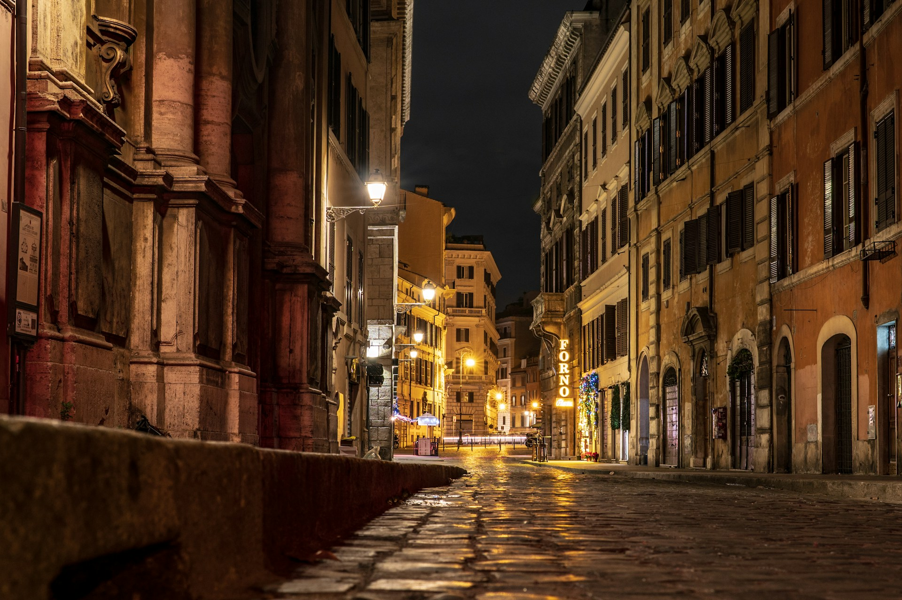
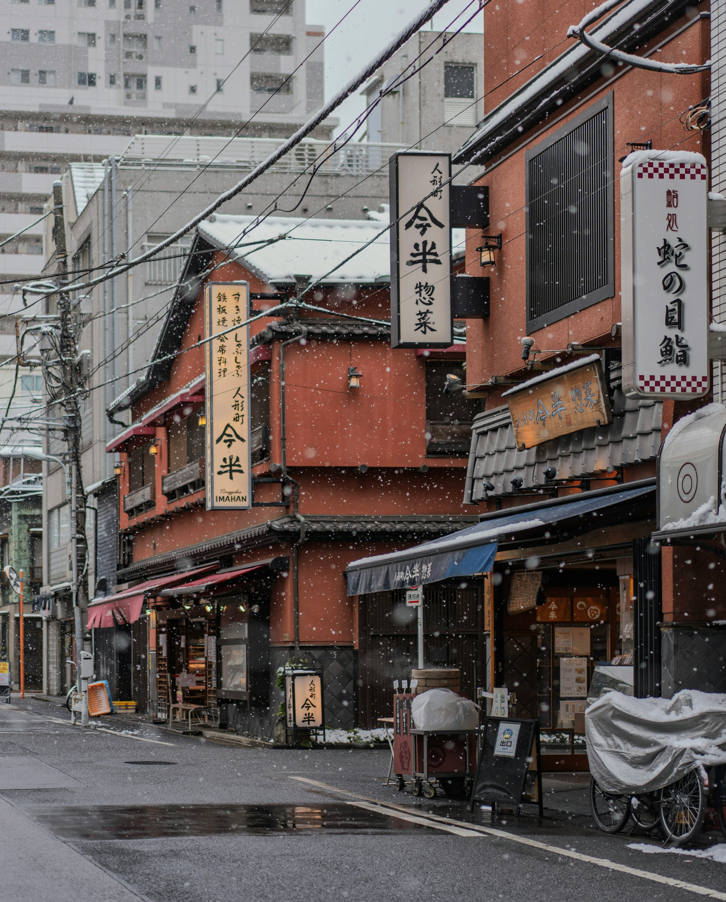
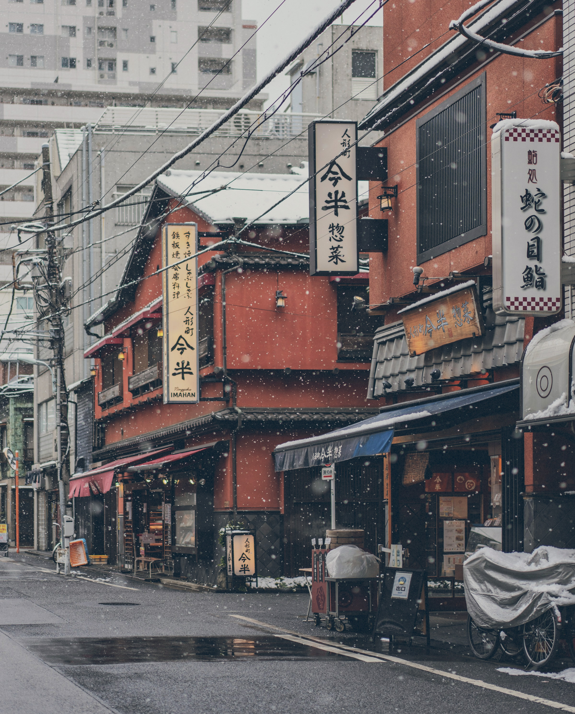
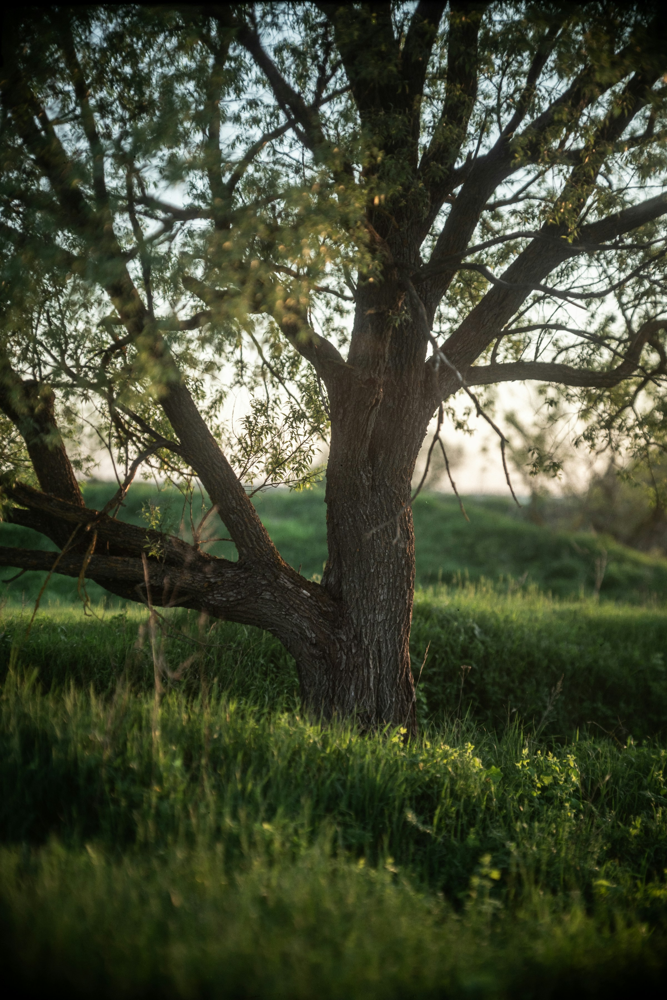
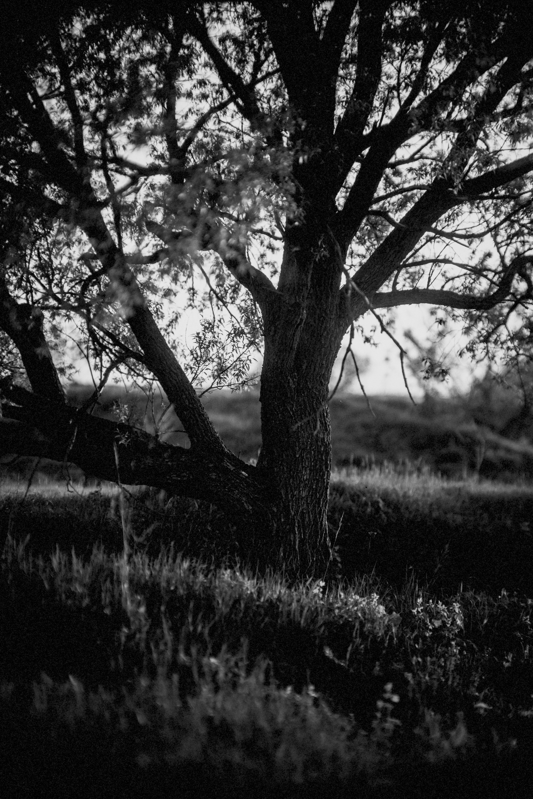

# filmlook

[](LICENSE)
[](Cargo.toml)

`filmlook` is a CLI-first Rust tool and library for applying deterministic film-emulation looks to images.

It uses data-driven JSON recipes for tone, color, grain, halation, vignette, and monochrome conversion, so looks can be bundled, edited, shared, and selected by id.

## Features

- Deterministic output with seedable grain
- Built-in film-inspired recipes embedded into the binary
- Editable JSON recipe format
- Single-image and recursive batch processing
- Density-aware, multi-scale grain
- Highlight-edge halation rather than global blur
- EXIF orientation handling by default
- Library API for reuse outside the CLI

## Quick Start

Process one image:

```sh
cargo run -- input.jpg output.jpg
```

Use a built-in recipe:

```sh
cargo run -- input.jpg output.jpg --recipe portra-400-35mm
```

Batch process a folder:

```sh
cargo run -- ./input-photos ./output-photos --recursive --recipe kodak-gold-200
```

For real exports or large batches, build the optimized binary:

```sh
cargo build --release
target/release/filmlook input.jpg output.jpg --recipe kodak-gold-200
```

## Recipes

List the bundled recipes:

```sh
cargo run -- --list-recipes
```

Built-in recipes are selected by the exact id shown in this list.

Current built-ins:

| Recipe | Character |
| --- | --- |
| `portra-400-35mm` | Soft contrast, warm skin bias, restrained saturation |
| `kodak-gold-200` | Warm consumer color with stronger yellows and reds |
| `ilford-hp5-plus-400` | High-speed monochrome-inspired contrast and grain |
| `cinestill-800t` | Tungsten night color with cool shadows, neon saturation, coarse grain, and red halation |

## Demo

| Original | Film render |
| --- | --- |
|  | <br>`cinestill-800t` |
|  | <br>`kodak-gold-200` |
|  | <br>`portra-400-35mm` |
|  | <br>`ilford-hp5-plus-400` |

Demo source photos are from [Unsplash](https://unsplash.com/).

Use a custom recipe file:

```sh
cargo run -- input.jpg output.jpg --recipe ./recipes/my-look.json
```

Validate a recipe:

```sh
cargo run -- --validate-recipe ./recipes/my-look.json
```

Named stock recipes are inspired tunings for research and local use. Review trademark and licensing implications before public commercial use.

## Controls

Recipe defaults can be overridden from the CLI:

```sh
filmlook input.jpg output.jpg \
  --recipe portra-400-35mm \
  --exposure-stops 0.3 \
  --contrast 1.05 \
  --shadows 0.15 \
  --highlight-rolloff 1.2 \
  --grain 0.4 \
  --grain-size 0.55 \
  --halation 0.3 \
  --vignette 0.15 \
  --seed 42
```

Common controls:

| Flag | Purpose |
| --- | --- |
| `--strength` | Overall look amount, `0.0..1.0` |
| `--exposure-stops` | Virtual exposure offset, `-3.0..3.0` |
| `--contrast` | Midtone contrast multiplier |
| `--shadows` | Toe and shadow adjustment, `-1.0..1.0` |
| `--highlight-rolloff` | Shoulder strength, `0.0..2.0` |
| `--grain` | Density-aware grain amount, `0.0..1.0` |
| `--grain-size` | Grain scale, `0.0..1.0` |
| `--halation` | Highlight-edge halation amount, `0.0..1.0` |
| `--vignette` | Edge darkening amount, `0.0..1.0` |
| `--seed` | Deterministic grain seed |
| `--quality` | JPEG output quality |

## Recipe Format

Recipes are plain JSON. They define metadata, defaults, tone response, channel response, color shaping, grain, halation, and monochrome behavior.

Hue-sector shaping can target specific color families:

```json
{
  "hue_sectors": [
    {
      "center_degrees": 120.0,
      "width_degrees": 70.0,
      "softness": 0.5,
      "amount": 1.0,
      "hue_shift_degrees": -8.0,
      "saturation_scale": 0.92,
      "luminance_scale": 1.02
    }
  ]
}
```

CLI controls override recipe defaults at runtime without modifying the JSON file.

## Project Status

`filmlook` is an early MVP. The command-line interface, recipe schema, and library API may change before a stable release.

Current engine notes:

- Input pixels are decoded as sRGB-like RGB and converted to linear RGB before processing.
- EXIF orientation is applied by default. Use `--no-auto-orient` to disable it.
- Embedded ICC profiles are detected and reported, but full ICC conversion is not implemented yet.
- RAW input is not currently supported.

Likely next steps:

- ICC profile conversion
- Golden-image snapshot tests
- Output format conversion in batch mode
- User recipe discovery from a config directory
- A separate RAW-oriented pipeline

## License

MIT © Forjd.
